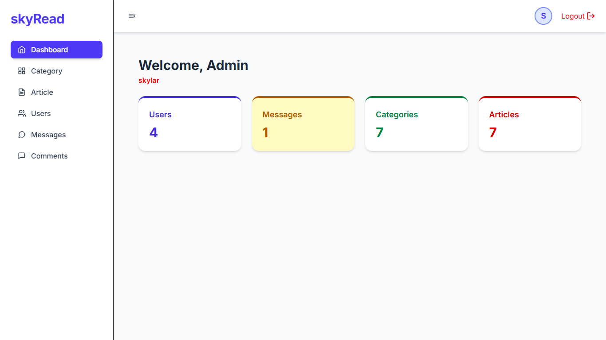
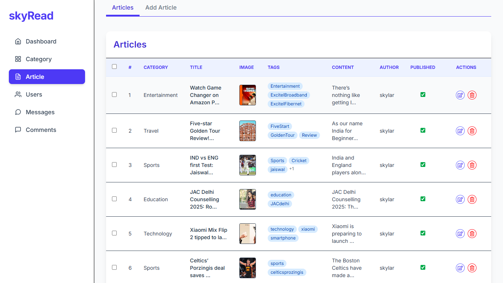
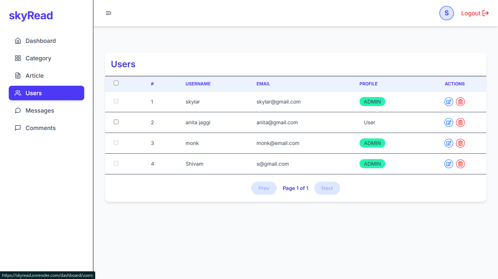
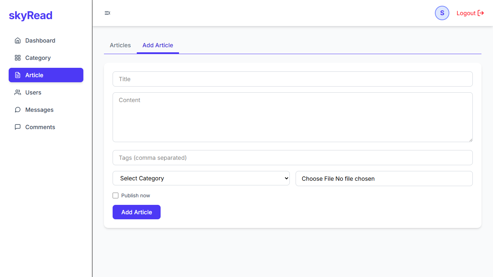

# Blog Platform with Admin Panel (MERN Stack)
https://skyread.onrender.com/
A clean and functional blog platform built using the MERN stack, designed for admin-controlled content publishing with user interaction features like comments and likes.

---

## Features

- 🔐 JWT Authentication (Admin & User roles)
- ✍️ Admin-only blog creation and editing
- 🗨️ User comment system
- ❤️ Like functionality
- 📄 Pagination support
- ☁️ Cloudinary integration for blog images
- 📱 Responsive UI with TailwindCSS
- 📊 Admin Dashboard

---

## Tech Stack

Frontend:
- React.js
- TailwindCSS
- Axios
- React Router DOM
- redux redux-toolkit

Backend:
- Node.js
- Express.js
- MongoDB (Atlas)
- Mongoose
- JSON Web Tokens (JWT)
- Bcrypt.js

Other:
- Cloudinary (for image upload)
- Dotenv, CORS, Multer

---

## Installation & Setup

### Backend
```bash
cd server
npm install
npm start

```
### frontend
```bash
cd client
npm install
npm run dev

```
## Admin Panel Preview





